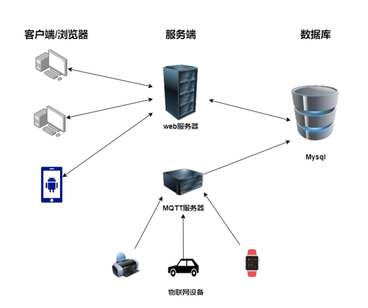
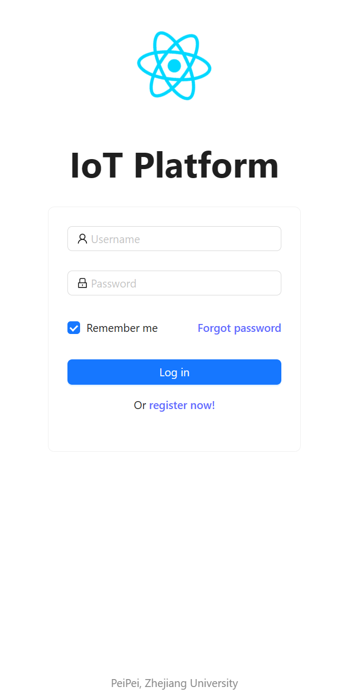
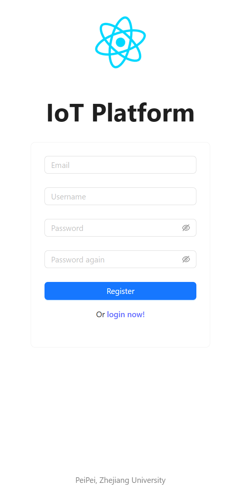
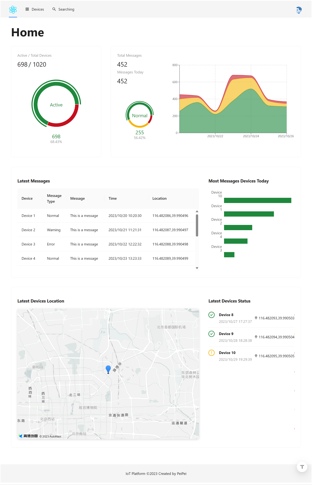
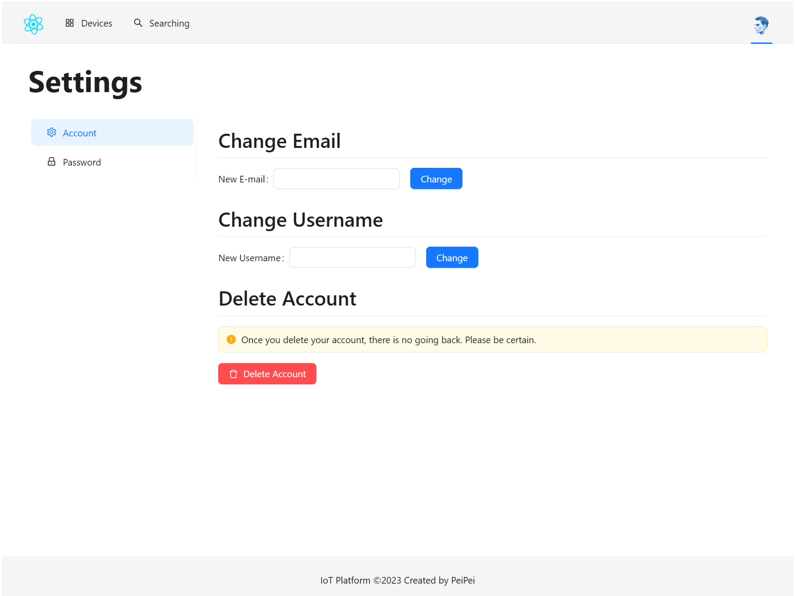
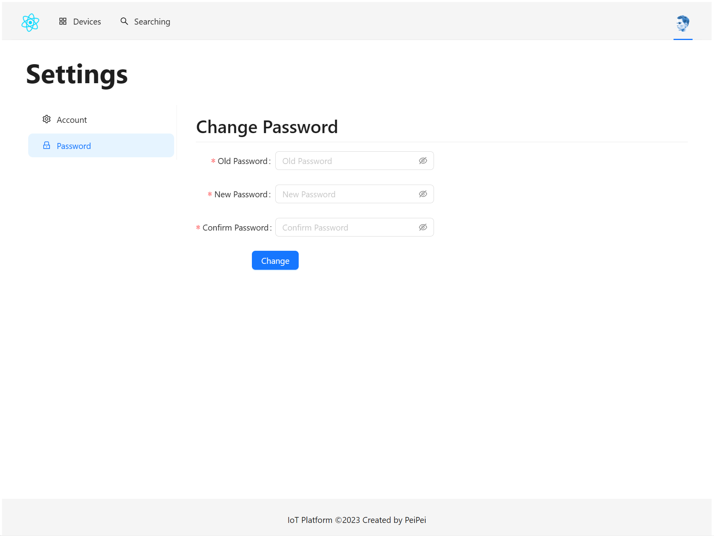
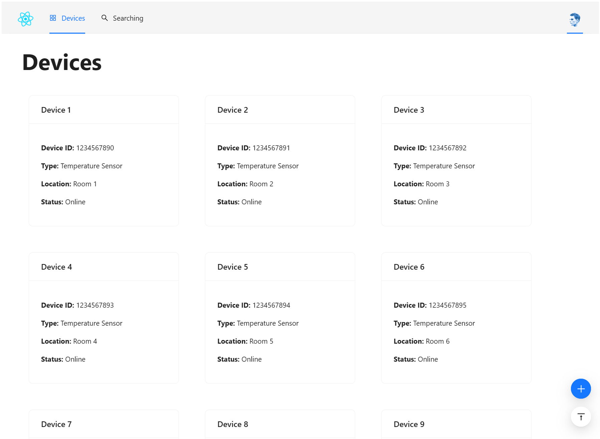
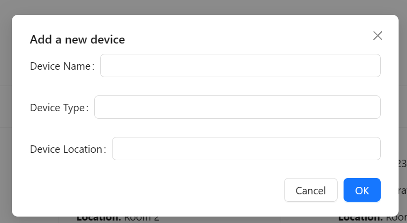
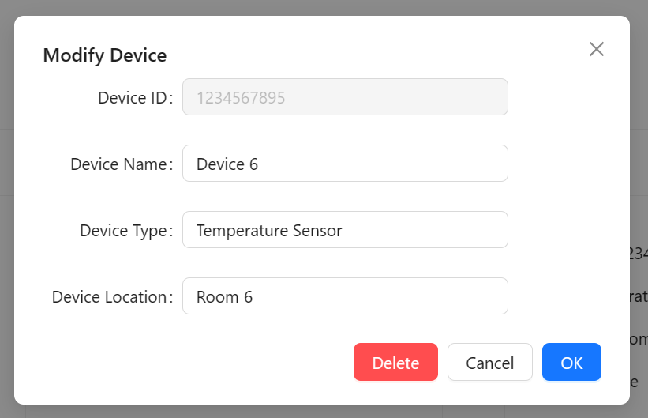
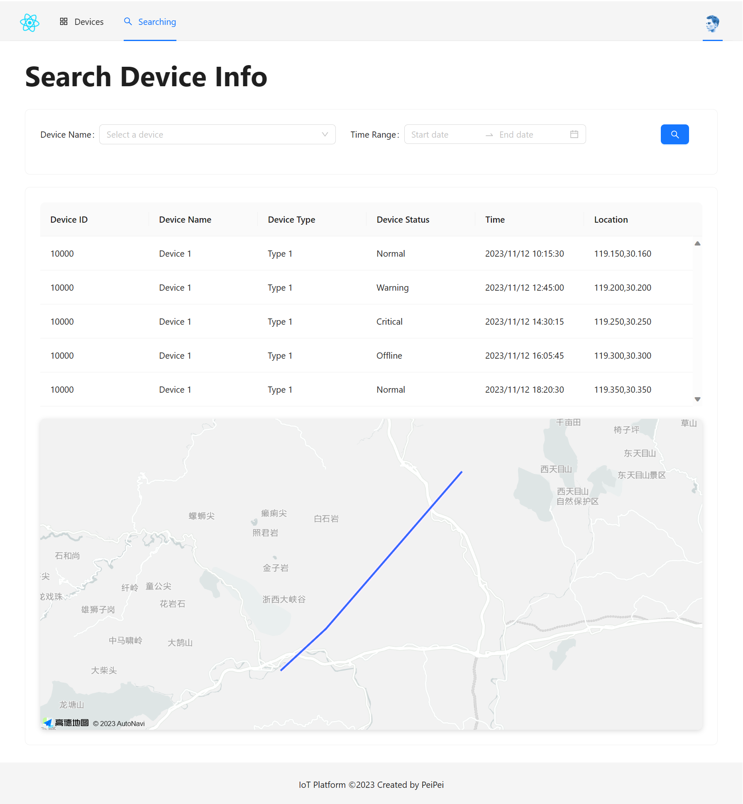

# 物联网应用网站 设计报告

## 引言

### 编写目的

这个项目是2020-2021春夏学期《B/S体系软件设计》的一项重要课程项目，旨在开发一个功能强大的物联网应用网站。用户登录后，能够轻松修改个人信息和物联网设备的配置信息，同时查看设备信息的可视化界面，包括设备的运动轨迹和统计数据。这个网站不仅要用户友好，而且要适配手机移动端，确保在手机浏览器和内置于应用程序（如微信）的浏览器中都能够良好地展示。此外，项目还需要提供详尽的软件项目文档，以帮助开发者了解并掌握一整套 web 应用开发技术以及整个开发流程。

这份文档是项目的系统设计文档，包含了系统的需求分析、总体架构设计、数据库设计、系统接口、以及界面原型的设计等内容。它详细描述了物联网设备应用网站的设计细节。这个项目的范围涵盖了完整的 web 前后端开发、MQTT 服务器的搭建，以及相关项目文档的编写，而且整个项目将由单一开发者独立完成。

### 项目背景

物联网（IoT，Internet of Things）是一种强大的概念，它将各种信息传感设备与互联网相连接，形成一个庞大的网络，使得人、机、物在任何时间、任何地点都可以互相连接和互通。

物联网的应用领域广泛涵盖了工业、农业、环境、交通、物流、安全等基础设施领域。它在这些领域的应用有效地推动了智能化发展，使得资源的分配更加合理，提高了行业的效率和效益。此外，在家居、医疗健康、教育、金融服务、旅游等与日常生活密切相关的领域，物联网也带来了革命性的改进。这些改进涵盖了服务的范围、方式以及服务质量的提升，显著提高了人们的生活质量。

本网站作为一个物联网应用网站，采用了B/S结构的设计，旨在实现物联网的基本功能，包括接收和统计分析指定物联网终端的数据。这个网站将为用户提供方便的接入和数据分析功能，为物联网的应用提供了有力的支持。

## 系统需求分析

### 实验要求

需要实现的基本功能如下：

1. 搭建一个 mqtt 服务器，能够接收指定的物联网终端模拟器发送的数据。
2. 实现用户注册、登录功能，用户注册时需要填写必要的信息并验证，如用户名、密码要求在6字节以上，email 的格式验证，并保证用户名和 email 在系统中唯一，用户登录后可以进行以下操作。
3. 提供设备配置界面，可以创建或修改设备信息，包含必要信息，如设备ID、设备名称等。
4. 提供设备上报数据的查询统计界面。
5. 提供地图界面展示设备信息，区分正常和告警信息，并可以展示历史轨迹。
6. 首页提供统计信息（设备总量、在线总量、接收的数据量等），以图表方式展示（柱状体、折线图等）

增强功能：

7. 样式适配手机端，能够在手机浏览器/微信等应用内置的浏览器中友好显示。

### 功能解析

该项目主要是一个 B/S 架构的 Web 应用，对于每个用户，它提供了以下功能：

- 用户注册与登录（用户管理）
- 用户信息修改
- 设备位置信息查看（可视化界面、显示设备的运动轨迹）
- 设备配置信息修改
- 设备统计数据查看（可视化界面、显示基于图标的统计信息）

同时，该项目还需要搭建一个 MQTT 服务器，用于接收物联网终端模拟器发送的数据。

### 非功能性需求分析

#### 性能需求

在确保系统的稳定性方面，我们的首要任务是避免系统崩溃。这是一个不可或缺的要求，因为崩溃会导致用户无法正常使用系统，造成极大的不便。

另外，我们的系统应该在当前主流的浏览器中能够正常运行。这意味着用户可以使用他们喜欢的浏览器来访问系统，而不必担心兼容性问题。

为了满足大量用户的需求，我们需要确保系统能够支持至少100人的并发访问。这是一个重要的性能指标，以确保系统在高负载情况下仍然能够稳定运行。

此外，系统对于用户的响应时间也是至关重要的。用户在登录和进行任何操作时，都希望系统能够迅速响应，反应时间应该在1秒以内。这可以提供良好的用户体验，让用户感到系统的高效性和流畅性。

在检测非正常情况方面，系统应该能够及时发现各种问题，如与设备的通信中断或无法连接到数据库服务器等情况。这可以帮助我们迅速处理问题，避免用户长时间等待和不必要的困扰。

页面加载速度也是一个重要的性能指标。通常情况下，每个页面应该在1秒内加载完毕，即使在高峰时期，也不应该超过5秒。这可以确保用户能够快速访问所需的信息，而不必浪费时间等待页面加载。

最后，系统的稳定性还包括维护和重启的考虑。我们的目标是确保系统在一周内不超过一次维护和重启，以减少对用户的影响，同时保持系统的可用性。这将有助于提供连续的服务，让用户放心使用系统。

#### 输入输出需求

系统的输入主要来自用户的操作，包括登录、注册、修改个人信息、修改设备信息、查看设备信息等。这些操作都是通过网页表单来实现的，用户可以在表单中输入信息，然后通过点击按钮来提交表单。系统会对用户的输入进行验证，如果验证通过，就会执行相应的操作，否则会提示用户输入有误。

系统应该能够及时响应用户的操作，以确保用户能够及时得到反馈。这可以通过在网页中显示加载动画来实现，以告知用户系统正在处理请求。此外，系统还应该能够及时显示错误信息，以帮助用户纠正错误。

系统应不能被用户的非法输入所破坏，例如 SQL 注入攻击。为了防止这种情况的发生，我们需要对用户的输入进行严格的验证，确保用户的输入不会被误认为是 SQL 语句等等。

#### 数据管理需求

系统需要存储用户的个人信息、设备信息、设备数据等数据。这些数据应该能够长期保存，以便用户随时查看。此外，系统还应该能够及时更新数据，以确保数据的准确性。

为了保证数据的安全性，系统应该能够防止用户的非法访问。这可以通过对用户的身份进行验证来实现，例如在用户登录时，系统会验证用户的用户名和密码是否正确。此外，系统还应该能够防止用户的非法修改，例如在用户修改个人信息时，系统会验证用户的身份，以确保用户只能修改自己的信息。

系统的服务器软件必须提供可靠的数据备份和恢复手段。这意味着当服务器软件或硬件出现严重故障时，我们需要能够迅速恢复正常运行环境，依赖于备份的数据和账户信息。这是为了确保即使在不可预测的情况下，系统也能够保持数据的完整性和可用性。同时，我们非常重视系统的安全性，因此在系统中不会预留任何特殊账户和密码，以确保系统的账户信息的安全性。

系统还应具备一系列安全措施，包括加密登录和数据加密传输等。这些措施可以确保用户的数据在传输过程中得到保密和保护，防止数据在不同系统之间传输时遭到未经授权的访问。我们非常注重数据的保密性和安全性，以保障用户的隐私和数据的完整性。

#### 硬件需求

- 操作系统：Windows 11、Linux、macOS
- 内存：4GB 以上
- 硬盘：100GB 以上
- CPU：Intel Core i5 以上
- 网络：100Mbps 以上

## 系统总体架构设计与技术选型

### 系统功能模块设计

- 游客模块
  - 用户管理模块
    - 用户注册
    - 用户登录

- 用户模块
  - 用户信息管理模块
    - 用户登录
    - 用户信息修改
    - 用户注销
    - 用户密码修改
    - 用户登出
  - 设备配置模块
    - 设备信息修改
    - 设备信息删除
    - 设备信息添加
  - 设备数据统计模块
    - 设备数据统计
    - 设备上报信息统计
    - 统计可视化
  - 设备数据查询模块
    - 设备数据查询
    - 设备数据可视化
    - 查询数据可视化

### 系统总体架构设计

系统的总体架构如下图所示，这是一个高度可扩展的架构，旨在支持多种终端的访问，包括PC和手机等。我们的服务端主要由两部分组成：后端服务器和MQTT服务器。这两部分分别与数据库进行交互，以实现系统的各项功能。

后端服务器具有处理来自网页的HTTP请求的能力，这意味着它可以接受用户在网页上发出的请求，并对其进行处理。这是用户与系统交互的主要接口之一，负责处理用户的请求并提供相应的数据和功能。

MQTT服务器则具有接受来自设备的报文并存储在数据库中的功能。这一部分是物联网设备与系统之间的关键连接，负责接收来自设备的数据，并将其存储在数据库中，以供后续的分析和使用。



后端功能：
- 处理用户的需求输入
- 与数据库进行交互
- 功能模块的实现

MQTT服务器功能：
- Broker 模块：接收来自设备的数据，并将其存储在数据库中

物联网设备功能：
- 发布模拟信号，用 mqtt 协议将数据告知服务器

### 技术栈选择

#### 前端技术栈

选用 React 框架，使用 JavaScript 语言编写前端代码。React 是一个用于构建用户界面的 JavaScript 库，它可以帮助我们构建复杂的交互式 UI。React 采用组件化的设计思想，将 UI 拆分成一些独立的、可复用的组件，然后将这些组件组合起来，构成复杂的 UI。这种设计思想可以帮助我们提高代码的复用性，减少代码的冗余，提高开发效率。

同时，也使用了高德地图的 JavaScript API，用于在网页中显示地图。高德地图是一个基于 Web 的地图服务，它提供了丰富的地图数据和功能，可以帮助我们在网页中显示地图，并在地图上添加标记、绘制轨迹等。

#### 后端技术栈

选用 Spring Boot 框架，使用 Java 语言编写后端代码。Spring Boot 是一个用于构建 Java 应用程序的框架，它可以帮助我们快速构建基于 Spring 的应用程序。Spring Boot 提供了一系列的工具和插件，可以帮助我们快速搭建应用程序的基本框架，从而提高开发效率。

同时，也使用了 Eclipse Paho 的 MQTT 客户端，用于与 MQTT 服务器进行通信。Eclipse Paho 是一个用于构建 MQTT 客户端的框架，它提供了一系列的工具和插件，可以帮助我们快速构建 MQTT 客户端，从而实现与 MQTT 服务器的通信。

#### 数据库技术栈

选用 MySQL 数据库，使用 SQL 语言编写数据库代码。MySQL 是一个开源的关系型数据库管理系统，它可以帮助我们存储和管理数据。MySQL 提供了一系列的工具和插件，可以帮助我们快速构建数据库，从而实现数据的存储和管理。

## 数据处理

### 数据存储

本项目使用 MySQL 数据库存储数据，根据 SQL 语言的标准、数据的来源、产生等，将数据导入数据库。

### 数据安全

为了确保数据的完整性和安全性，我们采取了一系列重要的数据保护措施。首先，数据不得进行未经授权的修改，这意味着只有经过授权的用户才能对数据进行修改。这可以防止数据在传输和存储过程中被篡改、挪用或丢失。我们使用一定的密码加密技术，如md5，来确保数据的保密性。这种加密技术可以将数据转化为不可读的形式，只有经过正确的解密过程才能恢复原始数据。这可以有效地保护数据的隐私和保密性。我们提供了身份验证功能，例如token等，以确保用户的身份可用性。这意味着只有经过身份验证的用户才能访问系统，并且只能访问其具有权限的数据和功能。这可以防止未经授权的用户访问系统和数据。

### 数据库设计及建表

本项目的数据库一共设计了 3 张表，分别是用户表、设备表和数据表。其中，用户表用于存储用户的个人信息，设备表用于存储设备的配置信息，数据表用于存储设备上报的数据。

#### 用户表

用户表用于存储用户的个人信息，包括用户名、密码、邮箱等。其中，用户名和邮箱是唯一的，这意味着用户名和邮箱在系统中不能重复。这可以确保用户的唯一性，防止用户重复注册。此外，用户的密码是经过加密的，这可以确保用户的密码不会被泄露。

| 字段名 | 类型 | 长度 | 是否为空 | 是否唯一 | 备注 |
| --- | --- | --- | --- | --- | --- |
| uid | int | 11 | 否 | 是 | 主键，用户ID |
| username | varchar | 255 | 否 | 是 | 用户名 |
| password | varchar | 255 | 否 | 否 | 密码 |
| email | varchar | 255 | 否 | 是 | 邮箱 |

建表语句如下：

```sql
CREATE TABLE `user` (
  `uid` int(11) NOT NULL AUTO_INCREMENT,
  `username` varchar(255) NOT NULL,
  `password` varchar(255) NOT NULL,
  `email` varchar(255) NOT NULL,
  PRIMARY KEY (`uid`),
  UNIQUE KEY `username` (`username`),
  UNIQUE KEY `email` (`email`)
)
```

#### 设备表

设备表用于存储设备的配置信息，包括设备ID、设备名称、设备类型等。其中，设备ID是唯一的，这意味着设备ID在系统中不能重复。这可以确保设备的唯一性，防止设备重复添加。此外，设备的位置是经过加密的，这可以确保设备的位置不会被泄露。

| 字段名 | 类型 | 长度 | 是否为空 | 是否唯一 | 备注 |
| --- | --- | --- | --- | --- | --- |
| did | int | 11 | 否 | 是 | 主键，设备ID |
| name | varchar | 255 | 否 | 否 | 设备名称 |
| type | varchar | 255 | 否 | 否 | 设备类型 |
| description | varchar | 255 | 是 | 否 | 设备描述，可选 |
| created_at | datetime | 0 | 否 | 否 | 创建时间 |
| uid | int | 11 | 否 | 否 | 外键，用户ID |

建表语句如下：

```sql
CREATE TABLE `device` (
  `did` int(11) NOT NULL AUTO_INCREMENT,
  `name` varchar(255) NOT NULL,
  `type` varchar(255) NOT NULL,
  `description` varchar(255) DEFAULT NULL,
  `created_at` datetime NOT NULL,
  `uid` int(11) NOT NULL,
  PRIMARY KEY (`did`),
  UNIQUE KEY `did` (`did`),
  KEY `uid` (`uid`),
  CONSTRAINT `device_ibfk_1` FOREIGN KEY (`uid`) REFERENCES `user` (`uid`)
)
```

#### 数据表

数据表用于存储设备上报的数据消息，包括设备ID、数据类型、数据值等。其中，设备ID是唯一的，这意味着设备ID在系统中不能重复。这可以确保设备的唯一性，防止设备重复添加。此外，数据的值是经过加密的，这可以确保数据的值不会被泄露。

| 字段名 | 类型 | 长度 | 是否为空 | 是否唯一 | 备注 |
| --- | --- | --- | --- | --- | --- |
| mid | int | 11 | 否 | 是 | 主键，数据ID |
| did | int | 11 | 否 | 否 | 外键，设备ID |
| type | varchar | 255 | 否 | 否 | 数据类型 |
| value | varchar | 255 | 否 | 否 | 数据值 |
| stamp | datetime | 0 | 否 | 否 | 时间戳 |
| alert | int | 11 | 否 | 否 | 是否告警，0 为正常，1 为告警 |
| info | varchar | 255 | 是 | 否 | 设备发送的信息，可选 |
| latitude | double | 0 | 是 | 否 | 纬度，可选 |
| longitude | double | 0 | 是 | 否 | 经度，可选 |

建表语句如下：

```sql
CREATE TABLE `message` (
  `mid` int(11) NOT NULL AUTO_INCREMENT,
  `did` int(11) NOT NULL,
  `type` varchar(255) NOT NULL,
  `value` varchar(255) NOT NULL,
  `stamp` datetime NOT NULL,
  `alert` int(11) NOT NULL,
  `info` varchar(255) DEFAULT NULL,
  `latitude` double DEFAULT NULL,
  `longitude` double DEFAULT NULL,
  PRIMARY KEY (`mid`),
  UNIQUE KEY `mid` (`mid`),
  KEY `did` (`did`),
  CONSTRAINT `message_ibfk_1` FOREIGN KEY (`did`) REFERENCES `device` (`did`)
)
```

## 系统接口设计

### 用户信息接口

#### 用户注册

- 接口地址：/api/user/register
- 请求参数：包含用户名、密码和邮箱等信息
- 返回参数：包含注册结果和错误信息等信息
- 备注：密码已经经过前端加密，后端需要再次加密，并验证用户名和邮箱的有效性

#### 用户登录

- 接口地址：/api/user/login
- 请求参数：包含用户名、密码、是否自动登录等信息
- 返回参数：包含登录结果和错误信息等信息以及登陆成功后的 token

#### 用户注销

- 接口地址：/api/user/logout
- 请求参数：包含 token
- 返回参数：包含注销结果和错误信息等信息
- 备注：需要验证 token 的有效性

#### 用户修改用户名

- 接口地址：/api/user/change/username
- 请求参数：包含 token 和新用户名
- 返回参数：包含修改结果和错误信息等信息
- 备注：需要验证 token 以及新用户名的有效性

#### 用户修改邮箱

- 接口地址：/api/user/change/email
- 请求参数：包含 token 和新邮箱
- 返回参数：包含修改结果和错误信息等信息
- 备注：需要验证 token 以及新邮箱的有效性

#### 用户修改密码

- 接口地址：/api/user/change/password
- 请求参数：包含 token 和新密码
- 返回参数：包含修改结果和错误信息等信息
- 备注：需要验证 token 以及新密码的有效性

#### 用户删除账户

- 接口地址：/api/user/delete
- 请求参数：包含 token
- 返回参数：包含删除结果和错误信息等信息
- 备注：需要验证 token 的有效性

### 设备信息接口

#### 获取设备列表

- 接口地址：/api/device/list
- 请求参数：包含 token
- 返回参数：包含设备列表和错误信息等信息

#### 获取设备信息

- 接口地址：/api/device/info
- 请求参数：包含 token 和设备 ID
- 返回参数：包含设备信息和错误信息等信息
- 备注：需要验证 token 以及设备 ID 的有效性

#### 添加设备信息

- 接口地址：/api/device/add
- 请求参数：包含 token 和设备信息
- 返回参数：包含添加结果和错误信息等信息

#### 修改设备信息

- 接口地址：/api/device/change
- 请求参数：包含 token 和设备信息
- 返回参数：包含修改结果和错误信息等信息
- 备注：需要验证 token 以及设备 ID 的有效性

#### 删除设备信息

- 接口地址：/api/device/delete
- 请求参数：包含 token 和设备 ID
- 返回参数：包含删除结果和错误信息等信息
- 备注：需要验证 token 以及设备 ID 的有效性

#### 获取设备统计信息接口

- 接口地址：/api/device/statistics
- 请求参数：包含 token 和时间范围等信息
- 返回参数：包含设备统计信息和错误信息等信息

### 设备数据接口

#### 获取设备消息接口

- 接口地址：/api/message/list
- 请求参数：包含 token 和设备 ID、时间范围等信息
- 返回参数：包含设备消息列表和错误信息等信息

#### 获取设备轨迹信息接口

- 接口地址：/api/message/trajectory
- 请求参数：包含 token 和设备 ID、时间范围等信息
- 返回参数：包含设备轨迹信息和错误信息等信息

#### 获取消息统计信息接口

- 接口地址：/api/message/statistics
- 请求参数：包含 token 和时间范围等信息
- 返回参数：包含消息统计信息和错误信息等信息

## 系统界面设计

最终的系统界面与本文档的原型设计基本一致，但是在实现过程中，我们可能对界面进行了一些调整，以提高用户的体验。

### 登录界面



### 注册界面



### 首页、设备数据统计可视化界面



### 用户信息管理界面

修改用户名与邮箱：



修改密码：



### 设备信息管理界面

信息展示：



添加设备：



修改、删除设备：



### 设备数据查询界面



## 项目开发计划

| 开发时间 | 开发内容 |
| --- | --- |
| 11.11 前 | 系统需求分析、总体架构设计、技术选型 |
| 11.11 - 11.25 | 前端界面 UI 设计与开发 |
| 11.25 - 12.09 | 数据库及后端接口设计与开发 |
| 12.09 - 12.23 | 完成前端与后端的集成测试 |
| 12.23 - 12.30 | 完成系统的部署与测试 |
| 12.30 - 01.06 | 完成系统测试文档、用户手册等文档的编写 |